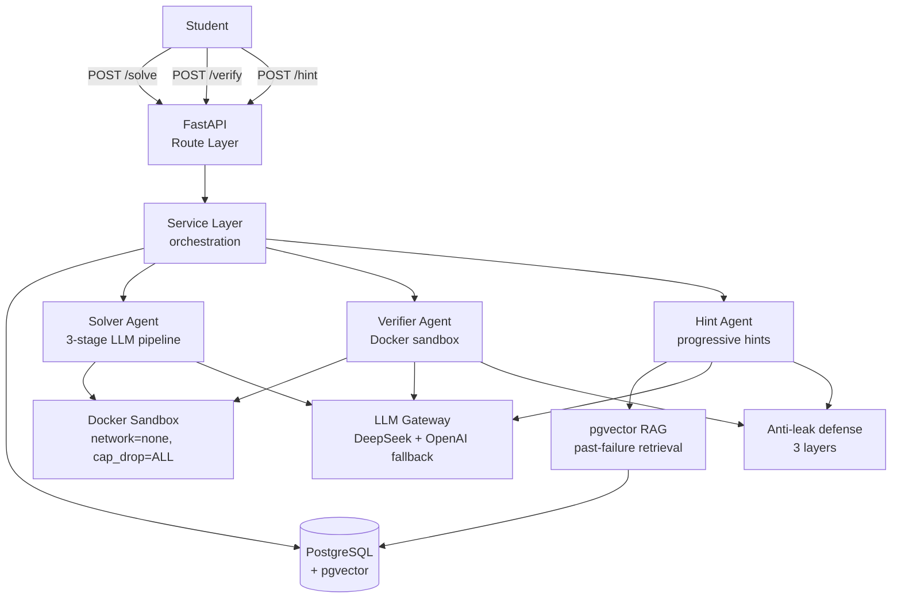

# StudyVerify

Verification-driven AI learning companion.

## Evaluation

**Production baseline: Step 11.** Step 12 (two-pointers strengthening + hint LLM temperature 0.3) was an attempted iteration that backfired and has been reverted. Latest report: [`backend/benchmark/results/2026-05-13_step12_eval.md`](backend/benchmark/results/2026-05-13_step12_eval.md). Prior reports: [Step 11](backend/benchmark/results/2026-05-12_step11_eval.md), [Step 10](backend/benchmark/results/2026-05-11_eval.md), [Step 9 baseline](backend/benchmark/results/2026-05-05_eval.md).

| Metric | Step 9 | Step 10 | **Step 11** | Step 12 (reverted) |
|---|---:|---:|---:|---:|
| Verifier accuracy | 84.2% | 100.0% | **100.0%** | 100.0% |
| Anti-leak combined | 70.6% | 60.0% | **60.1%** | 57.7% |
| ↳ Phrase filter | 93.8% | 92.0% | **85.1%** | 84.6% |
| ↳ LLM judge | 75.2% | 65.5% | **65.5%** | 64.7% |
| Helpfulness hint_1 | 91.9% | 97.2% | **94.5%** *(10-word)* | 95.3% |
| Helpfulness hint_5 | 96.1% | 98.1% | **95.2%** *(10-word)* | 95.9% |
| Latency p95 hint | 23s | 46s | **29s** | 27s |
| Production reliability | 99.6% | 97.4% | **99.4%** | 99.5% |

Step 11 is the current production baseline (in bold). Step 12 (two-pointers strengthening + hint LLM temperature 0.3) was an attempted iteration that backfired: anti-leak dropped −2.4 pp, and 6 of 7 Step-11-targeted topics regressed (notably two-pointers −14.0 pp on the directly targeted change). The production code was reverted to Step 11 settings. The Step 12 ablation data is preserved in [`backend/benchmark/results/2026-05-13_step12_eval.md`](backend/benchmark/results/2026-05-13_step12_eval.md) as documented evidence.

Notable findings:

- **LLM judge invariant across iterations:** 75.2% (Step 9) → 65.5% (Step 10) → 65.5% (Step 11) → 64.7% (Step 12). The Step 9 → Step 10 drop reflects the `entry_function` bug fix changing which hints reached the judge (more hard algorithmic-pattern hints in the corpus post-fix). The 65.5% / 65.5% / 64.7% sequence across Step 10/11/12 — same hint mix, different anti-leak interventions — shows the judge pinned at ~65% regardless of prompt constraints, phrase filter expansions, or temperature changes. Intrinsic structural-leakage ceiling under the current judge prompt. Real improvement requires either hint LLM upgrade or retry-on-judge-flag architecture (Step 13+ future work).
- **Lower temperature backfired despite intuition.** At T=0.3 the model substitutes *less* creatively but reaches for *more directly algorithmic phrasing* (e.g. "recursive call" verbatim, attribute access like `.l`/`.r`) — exactly what the LLM judge flags. The "creative substitution" theory of judge-gap closure does not survive the data.
- **More forbid-list entries can hurt.** Two-pointers went from 5 forbidden phrases to 19 and dropped −14 pp — *worse than having no per-topic constraint at all* (61.2% at Step 10 with zero phrases, 48.5% at Step 12 with 19). Over-constrained prompts appear to crowd out the user task and push the model toward fallback algorithmic English.
- **Helpfulness held under T=0.3** (+0.7 to +3.2 pp across hint levels) — the pre-flight risk for the temperature change did not materialize. Reverted not because helpfulness suffered, but because the anti-leak loss outweighed it.

See the [full Step 12 report](backend/benchmark/results/2026-05-13_step12_eval.md) for per-topic breakdowns, regression examples (Step 11 clean → Step 12 leaked), and Step 13 priorities.

## Engineering lessons

This project was built eval-driven: a 100-problem benchmark
(Step 9) surfaces issues, fixes are measured against it, and
results — including failures — are committed.

- **The benchmark caught a bug the unit tests couldn't.** Step 9
  showed 84.2% verifier accuracy. Investigation (Step 10) traced
  60 false-rejected reference solutions to the Solver LLM renaming
  the entry function during code generation — sandbox "function
  not found" errors, not logic errors. A one-line prompt
  constraint lifted verifier accuracy to 100%.

- **More forbidden phrases made anti-leak worse, not better.**
  Step 11 added per-topic anti-leak prompt constraints; targeted
  topics improved +13 to +30 pp. Step 11.5/12 pushed further —
  19 forbidden phrases for two-pointers, lower LLM temperature.
  The 100-problem re-eval showed that topic at 48.5%, *worse* than
  the 61.2% it had with no constraint at all. The interventions
  were reverted.

- **The LLM judge has an intrinsic ceiling.** Anti-leak LLM-judge
  pass rate held at ~65% across four different configurations
  (Step 10-12). Phrase filters and prompt constraints don't move
  it. Real improvement would require a different hint model or a
  retry-on-flag architecture — documented as future work, not
  pursued, because 60% is acceptable for a demo MVP.

- **Production deployment surfaces what local testing doesn't.**
  Six production-only fixes shipped over the project: Docker
  socket GID for sibling containers, sandbox image distribution,
  Linux file permissions, async SQLAlchemy lazy-load, student
  print() polluting sandbox stdout, and nginx proxy timeouts on
  slow LLM calls.

## Status

✅ **Production deployed — Step 11/12 complete (anti-leak iteration ongoing; LLM judge is binding constraint)**

Live demo: https://studyverify.vercel.app  
100-problem benchmark · Verifier 100% accuracy · 60% anti-leak baseline (primary frontier)

### What works
- ✅ FastAPI backend with `/health`, `/health/db`,
  `/api/v1/solve`, `/api/v1/verify`, `/api/v1/hint`, plus
  session-history GET endpoints
- ✅ Solver Agent: 3-stage LLM pipeline + sandbox self-verification
- ✅ Verifier Agent: runs student code in hardened Docker sandbox;
  generates diagnostic feedback that names neither code nor
  algorithm
- ✅ Hint Agent: progressive hints with diagnosis-as-seed for the
  first call; concurrent retry on hint_index race; hard cap of
  5 hints per verifier_session
- ✅ Anti-leak defense in depth across both Verifier and Hint:
  - Schema-level redaction (no `expected` field in any
    student-facing model)
  - Prompt construction never sees `expected` values
  - Algorithm-dictation guard with substring contract (no
    "use a loop", "iterate", "create a variable", "use sum()",
    etc.) enforced by integration tests
- ✅ Postgres + Redis + FastAPI via Docker Compose;
  `make compose-up-rebuild` is clone-and-run
- ✅ SQLAlchemy 2.0 async + Alembic migrations (3-stage backfill
  pattern for required-field additions)
- ✅ 4-layer architecture: Route → Service → Repository → Agent
- ✅ Docker sandbox with 14 hardening flags (network=none,
  cap_drop=ALL, pids_limit, etc.) verified via baseline
  isolation smoke tests
- ✅ Every solve / verify / hint invocation persisted; full
  session history queryable
- ✅ Multi-provider LLM gateway (DeepSeek primary + OpenAI
  fallback) with retry/backoff and provider-failure routing
- ✅ pgvector RAG retrieval over failed verifier sessions —
  past-failure inspiration for the Hint Agent, with
  algorithm-dictation guard applied to retrieved hints
- ✅ RAG corpus seeded from 50 LLM-generated buggy variants
  across 10 problems (84-row dev corpus) with cross-problem
  retrieval boundaries validated by Tier-1 deterministic
  pytest tests and a Tier-2 manual review script
- ✅ 200+ unit tests + 90+ integration tests across mocked,
  SQLite, real Postgres, real DeepSeek, and real Docker layers
- ✅ End-to-end smoke (`make smoke-stack`) covers full
  /solve → /verify → /hint chain
- ✅ Frontend (Next.js 14 + TypeScript + Monaco editor)
  deployed to Vercel at https://studyverify.vercel.app —
  3/3 Playwright smoke stable; loading UX with stage timers;
  TypeScript schema enforces anti-leak redaction at compile time
- ✅ User-uploaded custom Python problems with AI-assisted
  test case generation (Step 8 Phase A): inline modal upload +
  silent backend test case generation + sandbox-validated
  execution; localStorage persistence + sidebar problem
  switching
- ✅ 100-problem evaluation benchmark across 23 topics +
  300 student bug variants; 4 metrics quantified: verifier
  accuracy 100%, anti-leak 60%, hint helpfulness progression
  91.9% → 96.1%, latency P95 solve 40s / verify 14s / hint 46s
- ✅ Verifier asymmetric calibration bug surfaced by own
  eval, root-caused via re-instrumented diagnostic pipeline,
  fixed via one-line prompt constraint — verifier accuracy
  lifted 84.2% → 100% (380/380); 60/60 false-rejected
  references resolved
- ✅ Sandbox wrapper marker fix for student print() pollution
  (__STUDYVERIFY_RESULT_BEGIN__ / END markers)
- ✅ 5 production-only deployment fixes surfaced by Mac →
  Linux deploy (docker.sock GID, sandbox image distribution,
  Linux strict permissions, async SQLAlchemy lazy-load,
  student print stdout pollution)

## Quick Start with Docker

**Try the public demo**: https://studyverify.vercel.app

For local development:

Get the full stack (FastAPI + Postgres + Redis) running in three
commands.

```bash
# 1. Clone and configure
git clone https://github.com/lixuwei2005-star/StudyVerify.git
cd StudyVerify
cp .env.docker.example .env.docker

# 2. Edit .env.docker — set POSTGRES_PASSWORD and REDIS_PASSWORD
#    (generate with: openssl rand -hex 24)
#    For LLM features, also set DEEPSEEK_API_KEY (optional for /health)

# 3. Start the stack
make compose-up-rebuild
```

First run uses `compose-up-rebuild` to build the image; subsequent
restarts can use plain `make compose-up`.

After ~20-30 seconds (alembic migrations + healthcheck warmup), the
stack is healthy:

```bash
make compose-ps                              # all 3 healthy
curl http://localhost:8000/health            # → {"status":"ok",...}
curl http://localhost:8000/health/db         # → {"status":"ok","db":"reachable"}
```

To exercise the Solver Agent end-to-end (requires DEEPSEEK_API_KEY):

```bash
curl -X POST http://localhost:8000/api/v1/solve \
  -H "Content-Type: application/json" \
  -d "$(jq '.[0]' backend/tests/agents/fixtures/sample_problems.json)"
```

To submit student code against a solved problem:

```bash
SOLVER_ID=$(curl -s -X POST http://localhost:8000/api/v1/solve \
  -H "Content-Type: application/json" \
  -d "$(jq '.[0]' backend/tests/agents/fixtures/sample_problems.json)" | jq -r .session_id)
curl -X POST http://localhost:8000/api/v1/verify \
  -H "Content-Type: application/json" \
  -d "{\"solver_session_id\": \"$SOLVER_ID\", \"student_code\": \"def sum_list(nums):\\n    return sum(nums)\"}"
```

To request a progressive hint when verification fails (each call
returns the next hint, more specific than the last, without naming
code or algorithm steps):

```bash
VERIFIER_ID=$(curl -s -X POST http://localhost:8000/api/v1/verify \
  -H "Content-Type: application/json" \
  -d "{\"solver_session_id\": \"$SOLVER_ID\", \"student_code\": \"def sum_list(nums):\\n    return 0\"}" | jq -r .session_id)
curl -X POST http://localhost:8000/api/v1/hint \
  -H "Content-Type: application/json" \
  -d "{\"verifier_session_id\": \"$VERIFIER_ID\"}"
```

For an automated end-to-end check:

```bash
make smoke-stack
```

Stop with `make compose-down`. See [docs/runbook-docker.md](docs/runbook-docker.md)
for operations reference.

## Develop locally (hot reload)

For active backend development, run the FastAPI app on the host
with infrastructure containerized:

```bash
make compose-up-infra              # postgres + redis only
cd backend && uv run uvicorn app.main:app --reload
```

Edit code → uvicorn auto-reloads. Tests run against the same
infrastructure.

## Run tests

First-time PG test setup (one-time): create the `studyverify_test`
database that pg-marked tests use.

```bash
make test-db-create
```

```bash
cd backend

# Unit tests only (fast, no external dependencies)
uv run pytest -v -m "not integration"

# Integration tests (requires `make compose-up-infra` + DEEPSEEK_API_KEY
# + studyverify_test DB; OPENAI_API_KEY optional, enables RAG paths)
uv run pytest -v -m integration

# Slow tests (the full 10-problem solver-against-real-DeepSeek sweep;
# ~5-10 min, ~$0.05). Gated separately to keep the default integration
# suite cheap.
uv run pytest -v -m slow

# Full sweep (unit + integration; excludes slow by default unless added)
uv run pytest -v -m "not slow"
```

Test counts (Step 10):
- Unit: 280+ (mocked LLM, in-memory SQLite, benchmark
  schema/aggregate/judges)
- Integration: 90+ (real Postgres, real DeepSeek API, real
  Docker, pgvector retrieval-quality)
- E2E: 3/3 Playwright smoke stable on production frontend

## Architecture



Layered architecture with clear separation of concerns:

- **API layer** (`backend/app/api/routes/`) — thin handlers
- **Service layer** (`backend/app/services/`) — orchestration;
  parameter-injected sessions allow stateless service shells
- **Repository layer** (`backend/app/repositories/`) — pure DB
  access, never commits
- **Agent layer** (`backend/app/agents/`) — Solver with 3-stage
  LLM pipeline + sandbox self-verification
- **Sandbox** (`backend/app/sandbox/`) — subprocess isolation with
  rlimits + JSON-over-stdin (code/data separation)
- **Data layer** (`backend/app/db/`) — SQLAlchemy 2.0 async +
  Alembic migrations
- **LLM layer** (`backend/app/llm/`) — DeepSeek client with typed
  exceptions and retry/backoff
- **Verifier layer** (`backend/app/agents/verifier/`) — stateless
  agent runs student code in Docker sandbox; LLM generates
  diagnostic feedback with strict anti-leak prompt construction
- **Docker sandbox** (`backend/app/sandbox/docker_runner.py`) —
  14-flag hardened container with bind-mount payload delivery
  (cross-platform reliable)
- **Anti-leak defense** — RedactedTestResult schema + prompt
  construction omits expected values + DB JSONB never stores
  expected key; verified via Pydantic reflection tests +
  end-to-end LLM behavior tests
- **Hint layer** (`backend/app/agents/hint/`) — stateless
  progressive-hint agent with concurrent-insert handling and
  diagnosis-as-seed for the first hint
- **Algorithm-dictation guard** — Verifier and Hint prompts share
  a substring contract preventing the LLM from naming control
  structures, built-ins, or stepwise algorithms; enforced by
  integration tests
- **RAG retrieval** (`backend/app/services/retrieval_service.py`)
  — pgvector cosine over `verifier_sessions.failure_embedding`,
  joined to `solver_sessions.problem_id` for cross-problem
  quality assertions; reads only, never commits
- **Corpus operator tools** (`backend/app/scripts/`) —
  `generate_buggy_variants.py` produces LLM-assisted candidate
  buggy implementations (parse-validate-retry, provider-switchable
  via the existing LLM gateway); `seed_failure_corpus.py` drives
  /solve → /verify against the local stack with sha256-based
  idempotency, --dry-run, and a localhost-gated destructive
  reseed flow
- **Frontend** (Next.js 14 + TypeScript + Tailwind + Monaco) —
  TypeScript schema enforces anti-leak: `RedactedTestResult`
  interface has no `expected` field, compile-time type safety
  transports the schema contract from backend to frontend;
  Playwright smoke (3/3 stable); production deployed to Vercel
- **Benchmark layer** (`backend/benchmark/`) — 100-problem
  dataset with 300 student bug variants; `eval_pipeline.py`
  orchestrates /solve → /verify → /hint × 5 with anti-leak
  judge (33-phrase + LLM judge) and helpful judge (LLM-student
  quote-gated simulation); `aggregate.py` computes verifier
  accuracy / anti-leak success / helpfulness progression /
  latency P50/P95; `_make_report.py` generates per-run markdown
- **Sandbox wrapper markers** (`backend/app/sandbox/base_runner.py`)
  — `__STUDYVERIFY_RESULT_BEGIN__` / `__STUDYVERIFY_RESULT_END__`
  bracketing in stdout to isolate wrapper JSON from student
  print() pollution; production-surfaced in Step 8 Phase A

## Roadmap

### Completed
- ✅ Step 0-2: Environment, FastAPI skeleton, Solver Agent + sandbox
- ✅ Step 3: Persistence layer (Postgres + Alembic + Service/Repo + full Docker Compose stack)
- ✅ Step 4: Verifier Agent (Docker sandbox + diagnostic feedback + persistence + REST endpoints)
- ✅ Step 5: Hint Agent + verifier prompt tightening
- ✅ Step 6.1: Multi-provider LLM gateway (DeepSeek + OpenAI fallback)
- ✅ Step 6.2: pgvector RAG retrieval over failed verifier sessions
- ✅ Step 6.3: RAG corpus expansion (10 problems × 5 buggy variants), cross-problem retrieval-quality tests, and `RetrievedFailure.problem_id` threading
- ✅ Step 6.4: Anti-leak 3-layer defense (Pydantic schema + service-level retry + 33-phrase forbidden filter); TypeScript type system enforces redaction on frontend
- ✅ Step 7: Frontend (Next.js 14 + Monaco) deployed to Vercel. Live at https://studyverify.vercel.app · 3/3 Playwright smoke stable · loading UX with stage timers
- ✅ Step 8 Phase A: User-uploaded custom Python problems with AI-assisted test case generation. Modal upload → /api/v1/generate-test-cases → sandbox-validated execution. localStorage persistence + sidebar switching
- ✅ Step 9: 100-problem evaluation benchmark across 23 topics with 300 student bug variants. 4 metrics: verifier accuracy, anti-leak success, hint helpfulness (quote-gated LLM-student simulation), latency P50/P95. Full report: [`backend/benchmark/results/2026-05-05_eval.md`](backend/benchmark/results/2026-05-05_eval.md)
- ✅ Step 10: Verifier asymmetric calibration fix. Step 9 eval surfaced 60 false-rejected references on classic problems; root-caused via re-instrumented diagnostic pipeline as Solver LLM renaming `entry_function` during reference generation (56/56 false-rejects were sandbox `function not found` errors, not LLM judgment). One-line prompt constraint + schema source-of-truth lifted verifier accuracy 84.2% → 100% (380/380) on full re-eval. Report: [`backend/benchmark/results/2026-05-11_eval.md`](backend/benchmark/results/2026-05-11_eval.md)

### Future work

**P0 (current quality frontier)**
- **Anti-leak ceiling investigation.** LLM judge invariant across 4 configurations (Step 9 75.2% [different mix], Step 10 65.5%, Step 11 65.5%, Step 12 64.7%). Phrase filters, per-topic prompt constraints, and lower hint temperature have all failed to move it. Consider hint LLM model upgrade (DeepSeek → Claude/GPT-4) or retry-on-judge-flag architecture. Both increase production cost; ROI uncertain given current 60% baseline is acceptable for demo MVP.

**P1**
- RAG corpus expansion (currently 50 examples; aim 200+)
- Solver caching for cold-start failures
- Multi-language sandbox (Step 8 Phase B): Java support alongside Python

**Deferred**
- LangGraph orchestration: current explicit Python control flow is simpler and observable; revisit if state machine complexity warrants

## License

MIT (LICENSE file to be added).
